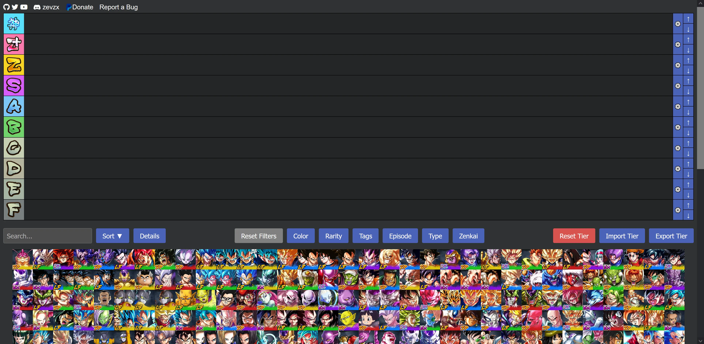

# DBLegendsTier

A website for creating tier lists with all Dragon Ball Legends characters.

## Features

- Basic Tier List making capabilities
- Tier icons
- Search bar
- Sort options (Card Number, Color, Rarity)
- Toggleable character details (Color, Rarity, Zenkai)
- Filter options (Color, Rarity, Tags, Episode, Type, Zenkai)
- Importing and Exporting tiers via JSON files

## License

This project is open source and available under the [MIT License](LICENSE).

## Contributing

Contributions, issues, and feature requests are welcome. Feel free to check [issues page](https://github.com/ZevZX/DragonBallLegendsTierList/issues) if you want to contribute.

## Data and Resources
- Some render images are sourced from [DBLegends.net](https://dblegends.net/).
- The github repository [DBLegendsAPI](https://github.com/feijoes/DBlegendsAPI) was used to extract the initial character data from [DBZ Space](https://legends.dbz.space/).

## Made by

ZevZX